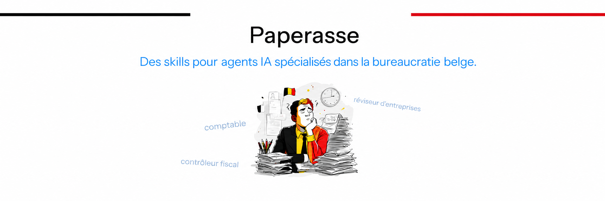

<p align="center">
  
</p>

<h1 align="center">Paperasse BE</h1>

<p align="center">
  <b>Des skills pour agents IA spécialisés dans la bureaucratie belge.</b>
</p>

<p align="center">
  <i>Parce que quelqu'un devait le faire, et ce quelqu'un n'a pas besoin de pause café.</i>
</p>

<p align="center">
  <a href="https://github.com/braingnac/paperasse-be/stargazers"></a>
  
  <a href="https://github.com/braingnac/paperasse-be/blob/master/LICENSE"></a>
</p>

<br />

---

## Qu'est-ce que Paperasse BE ?

<b>Paperasse BE est une collection de skills pour agents IA ([Claude Code](https://claude.com/product/claude-code), [Claude Cowork](https://claude.com/product/cowork), [Codex](https://openai.com/codex/), [Mistral Vibe](https://vibe.mistral.ai), [Cursor](https://cursor.com), [Windsurf](https://windsurf.com), [Cline](https://cline.bot), [Aider](https://aider.chat)) spécialisés dans la comptabilité, la fiscalité, la facturation, le notariat et l'audit des entreprises belges.</b>

Chaque skill transforme votre agent en copilote expert d'un métier de la paperasse : comptabilité (PCMN, TVA, ISOC, clôture annuelle, dépôt BCE), facturation (mentions obligatoires, facturation électronique Peppol 2026, e-reporting), contrôle fiscal SPF Finances, audit IRE/IEC, fiscalité des particuliers (IPP, précompte mobilier, VVPR bis, EIP, crypto, pension libre complémentaire), droit notarial (immobilier, succession, donation), et gestion de copropriété (ACP, AG, charges, travaux, impayés). Il connaît les textes (CIR 92, CTVA, loi du 17 juillet 1975, normes IEC/IRE, loi 1994 sur la copropriété), les formulaires, les échéances, et ne se trompe pas de case dans la déclaration ISOC.

Les skills sont du Markdown. Ils fonctionnent avec tout agent ou outil capable de lire des fichiers. Paperasse BE inclut aussi des connecteurs pour récupérer automatiquement vos transactions bancaires (Qonto) et paiements (Stripe).

---

## Installation rapide

### Via GitHub (recommandé)

Copiez-collez ces instructions dans votre agent IA :

```
Installe tous les skills du repo github https://github.com/braingnac/paperasse-be
Lance ensuite le setup pour la gestion de toute ma paperasse
```

L'agent va cloner le repo, installer les skills, et lancer le setup guidé qui vous posera quelques questions (nom de votre société, régime TVA, comptes bancaires) pour configurer votre environnement.

> **⚠️ Note de sécurité** : des registres tiers de distribution de skills (type agentskill.sh) injectent un bloc de télémétrie dans chaque skill au moment de l'installation (`POST` silencieux vers leurs serveurs après chaque tâche). Pour des skills qui manipulent des numéros BCE, des stratégies fiscales et des coordonnées bancaires, ce risque est inacceptable. Installez toujours depuis ce repo GitHub directement.

#### Installation manuelle

Si votre agent ne supporte pas le clone Git complet, attention aux liens symboliques vers les ressources partagées (`data`, `scripts`, `templates`, `integrations`).
Certains installateurs qui téléchargent les dossiers un par un via l'API GitHub les transforment en petits fichiers texte.
Voir [l'installation manuelle](docs/manual-install.md) pour les commandes et les vérifications.

---

## Les 6 skills

| Skill | Rôle | Ce qu'il fait |
|-------|------|---------------|
| **`comptable`** | Expert-Comptable (IEC) | Écritures comptables (PCMN), TVA belge (21%/12%/6%), ISOC, clôture annuelle complète, dépôt BCE, facturation (mentions obligatoires, facturation électronique Peppol, e-reporting) |
| **`controleur-fiscal`** | Contrôleur Fiscal | Simulation de contrôle SPF Finances sur 8 axes, chefs de redressement avec base légale et montants |
| **`reviseur-entreprises`** | Réviseur d'Entreprises (IRE) | Audit ISA/ISRS en 7 phases, validation croisée bilan/CR, opinion motivée |
| **`fiscaliste`** | Fiscaliste Particuliers | Fiscalité personnelle : IPP (barème, QF, réductions), précompte mobilier, VVPR bis, EIP, pension libre complémentaire, crypto (règle des revenus divers), revenus exceptionnels |
| **`notaire`** | Notaire | Frais de notaire, plus-value immobilière, successions (droits régionaux), donations, SRL patrimoniale, cohabitation légale, diagnostics |
| **`syndic`** | Syndic de Copropriété | Gestion d'un parc d'ACP : AG, appels de fonds, comptabilité (loi 1994), travaux, fournisseurs, impayés, transition de syndic |

---

## Exemples d'utilisation

```
> Voici mes transactions bancaires. Catégorise-les et génère les écritures PCMN.

> Fais la clôture annuelle de ma société pour l'exercice 2025.

> Simule un contrôle fiscal SPF Finances sur mes comptes 2025.

> Audite mes comptes annuels avant approbation.

> Calcule les frais de notaire pour un appartement à 350 000 EUR à Bruxelles.

> Ma mère est décédée, nous sommes 3 enfants. Calcule les droits de succession en Région wallonne.

> Rédige les statuts d'une SRL familiale pour gérer un immeuble locatif.

> Prépare la convocation de l'AG annuelle pour mon ACP.

> Donne-moi un tableau de bord de toutes mes copropriétés.

> Le copropriétaire du lot 7 n'a pas payé depuis 6 mois. Que faire ?

> Génère une facture conforme Peppol pour mon client TechSolutions SA.

> Suis-je prêt pour la facturation électronique obligatoire 2026 ?

> Je suis célibataire, salaire 50 000 EUR, calcule mon IPP 2025.

> J'ai 5 000 EUR de dividendes. VVPR bis ou régime ordinaire ?

> Mon patrimoine immobilier net est de 1,4 M EUR, quel est mon précompte immobilier en Région flamande ?
```

---

## Workflow : de zéro à la clôture annuelle

Vous pouvez lancer le workflow complet de clôture annuelle en copiant-collant le prompt suivant :

```
Fais la clôture annuelle de ma société
```

Les 4 skills s'enchaînent pour couvrir tout le cycle comptable :

1. **Comptabilité courante** (`comptable`) : classification des dépenses, écritures PCMN, TVA, rapprochement bancaire
2. **Clôture annuelle** (`comptable`) : cut-off, amortissements, provisions, ISOC, dépôt BCE
3. **Audit** (`reviseur-entreprises`) : vérification des comptes, contrôle croisé bilan/CR, opinion ISA
4. **Contrôle fiscal** (`controleur-fiscal`) : simulation SPF Finances sur 8 axes, chefs de redressement

---

## Intégrations (Qonto, Stripe)

Des connecteurs pour récupérer automatiquement les transactions bancaires et les paiements. Configuration dans `company.json`, clés API en variables d'environnement.

```bash
npm run fetch          # Récupère Qonto + Stripe
npm run fetch:qonto    # Qonto seulement
npm run fetch:stripe   # Stripe seulement
```

Supporte plusieurs comptes Stripe et Stripe Connect. Voir `integrations/` pour le détail de la configuration.

---

## Scripts et templates

Le repo inclut des scripts Node.js et des templates pour la génération de documents :

```bash
npm run closing    # Génère tout d'un coup (états financiers + PDFs)
```

| Script / Template | Génère |
|-------------------|--------|
| `calc.js` | Calculs déterministes (amortissements, ISOC, TVA, prorata) |
| `generate-statements.js` | Bilan, Compte de résultat, Balance |
| `generate-pdfs.js` | PDFs professionnels avec en-tête société |
| `templates/isoc-275.html` | Déclaration ISOC (formulaire 275) |
| `templates/declaration-tva.md` | Déclaration TVA belge |
| `templates/approbation-comptes.md` | PV d'approbation des comptes |
| `templates/declaration-confidentialite.html` | Déclaration de confidentialité |
| `templates/depot-bce-checklist.md` | Checklist dépôt à la BCE |

Prérequis : `npm install`, puis `cp company.example.json company.json` et remplir vos informations.

---

## Garde-fous

- **Contexte entreprise** : chaque skill vérifie les informations minimales (raison sociale, numéro BCE, forme juridique, régime TVA) avant de procéder. Si `company.json` existe, il est lu automatiquement. Sinon, le skill pose les questions.

- **Échéances fiscales** : le skill comptable affiche les prochaines échéances à chaque conversation (acomptes ISOC, TVA mensuelle/trimestrielle, précomptes, etc.).

- **Fraîcheur des données** : chaque skill a une date `last_updated`. S'il a plus de 6 mois, l'agent vérifie les chiffres en ligne avant de répondre. Le législateur belge change les règles plus souvent que vous changez de mot de passe. Contrairement à votre mot de passe, ça peut coûter cher.

- **Données open source** : PCMN complet issu de [fisconetplus.be](https://fisconetplus.be) et de la Commission des Normes Comptables (CNC). APIs publiques pour le CIR 92 et l'annuaire des entreprises (KBO/BCE). Sources documentées dans `data/sources.json`.

---

## Installation manuelle (par plateforme)

Les skills sont du Markdown. Ils marchent partout où un agent peut lire des fichiers.

| Plateforme | Où copier les skills |
|------------|---------------------|
| **Claude Code** | `~/.claude/skills/` |
| **Cursor** | `~/.cursor/skills/` |
| **Windsurf** | `~/.windsurf/skills/` |
| **Codex** | `~/.codex/skills/` |
| **Mistral Vibe** | `~/.vibe/skills/` |
| **Cline** | `~/.cline/skills/` |
| **Aider** | `~/.aider/skills/` |

---

## Evals

Chaque skill est évalué automatiquement avec et sans le SKILL.md pour mesurer sa valeur ajoutée. Le runner utilise `claude --bare` en isolation, un grading LLM-as-judge, une exécution parallèle (~20 min pour la suite complète), et un cache adressé par contenu pour réutiliser les runs inchangés d'une itération à l'autre.

```bash
# Lancer les evals
uv run --project evals python evals/run_evals.py

# Un seul skill
uv run --project evals python evals/run_evals.py --skill notaire

# Réutiliser le cache inter-itérations
uv run --project evals python evals/run_evals.py --reuse-cache

# Ne lancer que les skills impactés par la branche courante
uv run --project evals python evals/run_evals.py --changed-only --reuse-cache

# Voir les résultats dans le navigateur
python evals/generate_review.py evals-workspace/iteration-xxx/
```

Pour les PRs, un workflow GitHub Actions `Evals Smoke` résout les skills impactés par rapport à la branche de base, restaure le cache `evals-workspace/cache`, et exécute uniquement la sélection nécessaire.

**Derniers résultats** (claude-sonnet-4-6, grading haiku) :

| Skill | With Skill | Without Skill | Delta |
|-------|-----------|--------------|-------|
| reviseur-entreprises | 100% | 75% | **+25%** |
| notaire | 96% | 92% | +4% |
| controleur-fiscal | 91% | 87% | +4% |
| comptable | 89% | 77% | **+12%** |
| fiscaliste | 84% | 64% | **+20%** |
| syndic | 83% | 68% | **+16%** |
| **Aggregate** | **88%** | **75%** | **+13%** |

Le format `evals.json` est compatible avec le [framework officiel anthropics/skills](https://github.com/anthropics/skills/tree/main/skills/skill-creator).

---

## Avertissement légal

**Ces skills ne remplacent pas un expert-comptable inscrit à l'IEC, un réviseur d'entreprises agréé (IRE), ou un notaire en exercice.** Ils sont conçus comme outils d'aide à la décision et de préparation.

Pour les situations complexes (litiges, montages fiscaux, contrôles en cours), consultez un professionnel avec une assurance RC Pro et un numéro BCE.

---

## Contribuer

Vous avez un métier de la paperasse belge que vous aimeriez voir automatisé ? Consultez le [guide de contribution](CONTRIBUTING.md).

### Forks communautaires

Des forks par juridiction maintenus par la communauté :

- 🇫🇷 [**paperasse**](https://github.com/romainsimon/paperasse) (France) — le repo original, skills pour la paperasse française (PCG, DGFIP, NEP, liasse fiscale).
- 🇹🇳 [**paperasse-tn**](https://github.com/YassineAta/paperasse-tn) (Tunisie) — skills pour la paperasse tunisienne (IRPP, BCT/forex, RNE/NAT, SUARL).

Ces forks ne sont **pas maintenus par paperasse-be** : la fraîcheur des références fiscales et juridiques est de la responsabilité de leurs auteurs. Ouvrez une issue ici si vous voulez ajouter votre fork à cette liste.

---

## Sponsors

Paperasse BE est maintenu en open source grâce au soutien de ses sponsors. [Devenir sponsor](https://github.com/sponsors/braingnac).

### Founding Sponsors

<p align="center"><!-- sponsors-founding --><sub>Become the first <a href="https://github.com/sponsors/braingnac">Founding Sponsor</a>.</sub><!-- sponsors-founding --></p>

### Premier Sponsors

<p align="center"><!-- sponsors-premier --><sub>Become the first <a href="https://github.com/sponsors/braingnac">Premier Sponsor</a>.</sub><!-- sponsors-premier --></p>

### Sponsors

<p align="center"><!-- sponsors-sponsor --><sub>Become the first <a href="https://github.com/sponsors/braingnac">Sponsor</a>.</sub><!-- sponsors-sponsor --></p>

### Backers

<p align="center"><!-- sponsors-backer --><sub>Become the first <a href="https://github.com/sponsors/braingnac">Backer</a>.</sub><!-- sponsors-backer --></p>

### Supporters

<p align="center"><!-- sponsors-supporter --><sub>Become the first <a href="https://github.com/sponsors/braingnac">Supporter</a>.</sub><!-- sponsors-supporter --></p>

---

## Remerciements

- **L'administration belge** — Pour avoir créé un système si complexe qu'il nécessite une IA pour le comprendre (en trois langues, s'il vous plaît)
- **Le Plan Comptable Minimum Normalisé** — Moins de comptes que son cousin français, mais tout aussi redoutable
- **Le Code des Impôts sur les Revenus 1992** — Parce qu'une loi de 1992 qui s'appelle encore "1992" en dit long
- **L'IEC et l'IRE** — Pour les normes que personne ne lit mais que tout le monde cite
- **fisconetplus.be** — Pour les données ouvertes qui alimentent les skills

---

<p align="center">
  <i>La paperasse, c'est comme le cholestérol : y'en a du bon et du mauvais, mais surtout y'en a trop.</i>
  <br>
  — Personne de célèbre, jamais
</p>

---

<a href="https://www.star-history.com/?repos=braingnac%2Fpaperasse-be&type=date&legend=bottom-right">
 <picture>
   <source media="(prefers-color-scheme: dark)" srcset="https://api.star-history.com/image?repos=braingnac/paperasse-be&type=date&theme=dark&legend=top-left" />
   <source media="(prefers-color-scheme: light)" srcset="https://api.star-history.com/image?repos=braingnac/paperasse-be&type=date&legend=top-left" />
   
 </picture>
</a>

---

<p align="center">
  Fait avec des 🍟 et beaucoup de ☕ quelque part en Belgique | <a href="LICENSE">Licence MIT</a>
</p>
